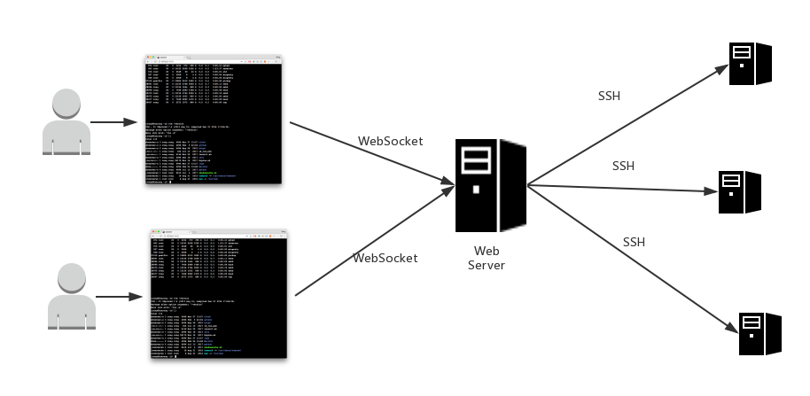

# web-ssh
web ssh terminal by Spring Boot

Java Spring 实现的浏览器端直接SSH连接目标服务器并支持交互操作。

Web SSH 终端的基本原理：

用到的相关依赖和框架：
* SpringBoot, Spring MVC
* WebSocket
* Jsch来实现SSH连接和交互
* 前端主要使用xterm.js：https://github.com/xtermjs/xterm.js
* 参考Python实现：https://github.com/huashengdun/webssh

在给前端xterm.js的url填ws://localhost:10003/ssh/1?hostname={你自己想要的ip}&port={端口号默认是22}&username={用户名}&password={密码}&rows={要在终端显示多少行}&cols={要在终端显示多少列}
